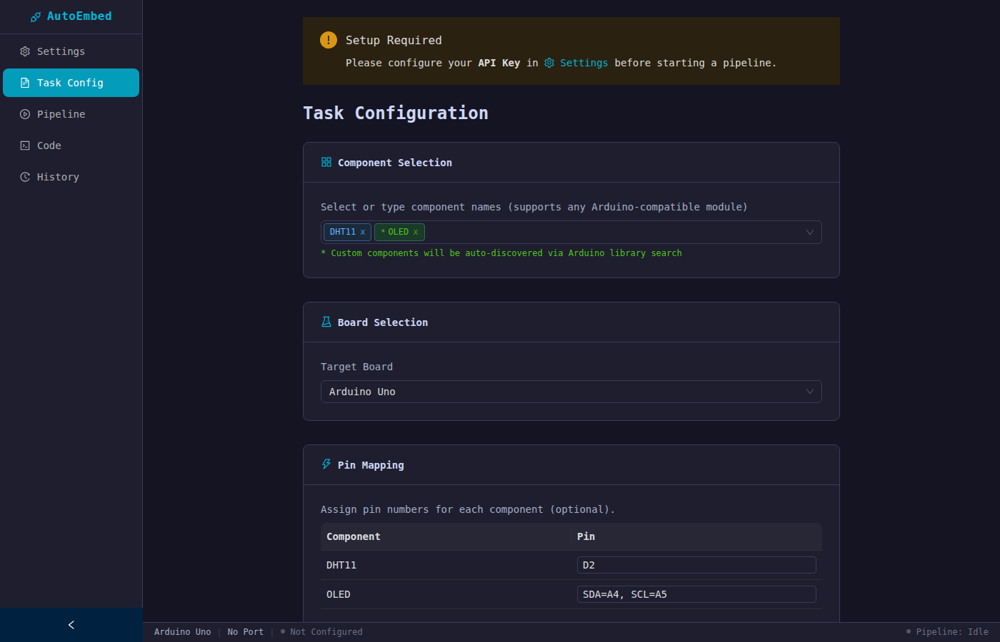
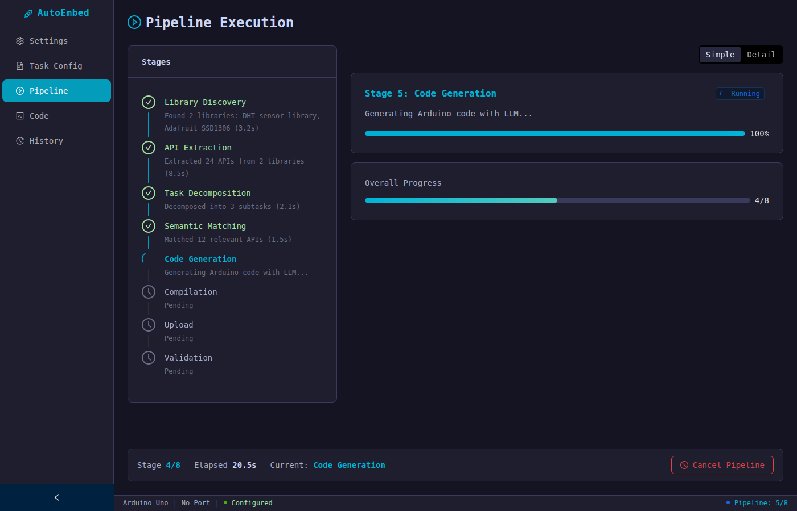
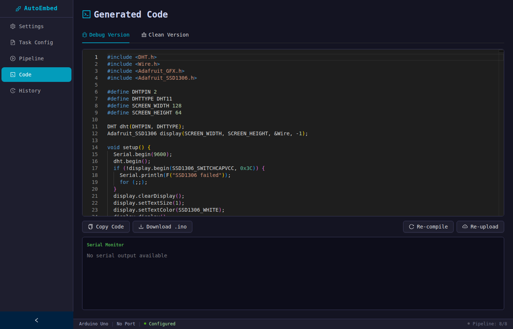
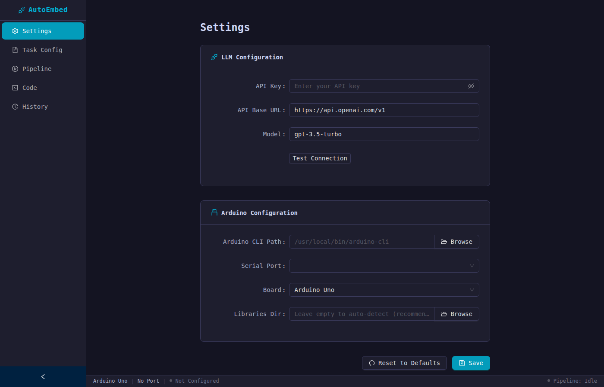

<div align="center">

**[English](README.md) | 中文**

# AutoEmbed

**面向通用嵌入式物联网系统的 LLM 驱动自动化软件开发**

首个通用嵌入式物联网系统全自动软件开发平台 —— 从自然语言到真实硬件上的验证代码。

[](https://autoembed.github.io)
[](https://autoembed.github.io)
[](LICENSE)
[](https://github.com/AutoEmbed/AutoEmbed/releases)

[[论文]](https://autoembed.github.io)&ensp;
[[网站]](https://autoembed.github.io)&ensp;
[[下载]](https://github.com/AutoEmbed/AutoEmbed/releases)&ensp;
[[引用]](#引用)

</div>

## 亮点

- **95.7% 代码准确率**，覆盖 355 个嵌入式物联网任务、71 个硬件模块和 4 个平台
- **86.5% 端到端成功率**，包括编译、烧录和运行时验证
- **比 GPT-4 高 23.7 个百分点**，比 Claude 高 27.7 pp，比 Gemini 高 30.7 pp
- **零 API 幻觉** —— 从库源代码中提取真实 API，而非依赖 LLM 记忆
- **支持任意 Arduino 兼容组件** —— 从 7,000+ Arduino 库中动态发现

## 界面展示

| 任务配置 | 流水线执行 |
|:--:|:--:|
|  |  |
| 配置组件、引脚映射，用自然语言描述任务 | 8 阶段实时流水线，进度可视化 |

| 生成代码 | 设置 |
|:--:|:--:|
|  |  |
| 内置 Monaco 编辑器，语法高亮显示 | LLM API 和 Arduino CLI 配置 |

## 工作原理

AutoEmbed 通过 4 阶段流水线实现全自动硬件在环开发：

```
自然语言任务描述
        │
        ▼
┌──────────────────┐     ┌──────────────────┐     ┌──────────────────┐     ┌──────────────────┐
│    库发现与解析    │ ──▶ │    知识生成       │ ──▶ │   选择性记忆注入   │ ──▶ │    自动编程       │
│                  │     │                  │     │                  │     │                  │
│ arduino-cli      │     │ .h → API 表      │     │ TF-IDF 检索      │     │ 生成代码          │
│ 搜索 + 排序      │     │ .ino → 使用模式   │     │ 匹配相关 API      │     │ 编译 → 修复       │
│ 自动安装         │     │ LLM 摘要         │     │ 减少 26.2% Token │     │ 烧录 → 验证       │
└──────────────────┘     └──────────────────┘     └──────────────────┘     └──────────────────┘
                                                                                    │
                                                                                    ▼
                                                                          真实硬件上的
                                                                           验证代码
```

## 快速开始

### 下载

从 [**Releases**](https://github.com/AutoEmbed/AutoEmbed/releases) 下载最新安装包：

| 平台 | 文件 | 大小 |
|------|------|------|
| Windows | [`AutoEmbed-Setup-1.0.2.exe`](https://github.com/AutoEmbed/AutoEmbed/releases/download/v1.0.2/AutoEmbed-Setup-1.0.2.exe) | 101 MB |
| macOS (Apple Silicon) | [`AutoEmbed-1.0.2-mac-arm64.zip`](https://github.com/AutoEmbed/AutoEmbed/releases/download/v1.0.2/AutoEmbed-1.0.2-mac-arm64.zip) | 120 MB |
| macOS (Intel) | [`AutoEmbed-1.0.2-mac-x64.zip`](https://github.com/AutoEmbed/AutoEmbed/releases/download/v1.0.2/AutoEmbed-1.0.2-mac-x64.zip) | 124 MB |

> [!NOTE]
> **前置要求：** [Arduino CLI](https://arduino.github.io/arduino-cli/installation/)、USB 驱动（CH340/CP2102）以及任意 [OpenAI 兼容 API](https://platform.openai.com/) Key。

### 配置

1. 启动 AutoEmbed，进入 **Settings** —— 配置 LLM API Key、Arduino CLI 路径、串口和开发板类型
2. 进入 **Task Config** —— 选择组件、映射引脚连接、用自然语言描述你的任务
3. 点击 **Start Pipeline** 开始自动生成

### 使用示例

| 任务描述 | 组件 |
|---------|------|
| `Read temperature every 5 seconds and display on serial monitor` | DHT11 |
| `When distance is less than 20cm, turn on buzzer` | HC-SR04, Buzzer |
| `Blink an LED every 500ms` | LED |

## 功能特性

- **自然语言 → 部署代码** —— 描述需求，自动获得编译和验证后的 Arduino 代码
- **71+ 硬件模块** —— 涵盖传感器、执行器、显示器、通信模块等 14 个类别
- **4 阶段自动化流水线** —— 库发现 → 知识生成 → 选择性记忆注入 → 自动编程
- **嵌套反馈循环** —— 内层（编译 → 修复 → 重编译）+ 外层（烧录 → 验证 → 重写），在部署前捕获 73% 的 Bug
- **实时进度** —— 基于 WebSocket 的流水线各阶段实时更新
- **内置代码编辑器** —— Monaco 编辑器，支持查看和编辑生成的代码
- **一键编译上传** —— 集成 Arduino CLI，无缝硬件部署

<details>
<summary><b>支持的硬件（71+ 模块，4 个平台）</b></summary>

### 平台

| 平台 | 架构 | 芯片 |
|------|------|------|
| Arduino Uno | AVR | ATmega328P |
| STM32 Nucleo | ARM Cortex-M | STM32F4 |
| Raspberry Pi Pico | RP2040 | 双核 ARM |
| ESP32 | Xtensa | 双核 LX6 |

### 硬件模块

| 类别 | 示例 |
|------|------|
| 温度 | DHT11, DHT22, DS18B20, LM35, LM75, MLX90614, SHT31, SHT40 |
| 环境 | BME680, BME280, SGP30, SGP40 |
| 距离/超声波 | HC-SR04, VL53L0X |
| 运动/IMU | ADXL345, ADXL362, MPU6050 |
| 光/颜色/紫外线 | TCS34725, APDS9960, BH1750, LTR390 |
| 气体 | MQ-2, MQ-135, CCS811 |
| 气压 | MS5611, BMP085, BMP280 |
| 磁力计/罗盘 | HMC5883L, QMC5883L |
| 电源/电流 | INA219, ADS1115 |
| 显示 | OLED (SSD1306), LCD (I2C) |
| 通信 | LoRa, NFC, Wi-Fi, Bluetooth |
| 执行器/输出 | Servo, Buzzer, LED, Relay, MCP4725 |
| 存储 | SD Card, EEPROM |
| 输入 | PIR, IR Receiver, Rotary Encoder, HX711 |

> 支持任意 Arduino 兼容组件 —— AutoEmbed 从 7,000+ Arduino 生态系统中动态发现库并通过 LLM 提取 API。

</details>

## 架构

```
┌─────────────────────────────────────────────────────────┐
│                    Electron 桌面应用                      │
│  ┌───────────────────────────────────────────────────┐  │
│  │               React + TypeScript                  │  │
│  │   Settings → TaskConfig → Pipeline → CodeView     │  │
│  │      Ant Design 5  ·  Zustand  ·  Monaco          │  │
│  └────────────────────────┬──────────────────────────┘  │
│                      REST / WebSocket                    │
│  ┌────────────────────────┴──────────────────────────┐  │
│  │             Python FastAPI 后端                    │  │
│  │                                                    │  │
│  │   阶段 1: 库发现与解析                              │  │
│  │   阶段 2: 知识生成                                  │  │
│  │   阶段 3: 选择性记忆注入                             │  │
│  │   阶段 4: 自动编程（嵌套反馈循环）                    │  │
│  │                                                    │  │
│  │        LLM API (OpenAI 兼容)                       │  │
│  │        Arduino CLI  ·  串口                        │  │
│  └────────────────────────────────────────────────────┘  │
└─────────────────────────────────────────────────────────┘
```

## 开发

```bash
git clone https://github.com/AutoEmbed/AutoEmbed.git
cd AutoEmbed

# 前端
npm install

# 后端
pip install -r backend/requirements.txt

# 开发模式（Electron + Python 后端）
npm run dev

# 构建
npm run build:win    # Windows
npm run build:mac    # macOS
```

## 常见问题

**Q: Pipeline 在 Library Discovery 阶段失败？**
A: 检查 Arduino CLI 路径是否正确，确保网络能访问 Arduino 库。

**Q: 编译失败？**
A: 系统会自动重试最多 5 次。如果持续失败，检查 Board 选择是否与实际硬件匹配。

**Q: 上传失败？**
A: 检查串口设置，确保 Arduino 已通过 USB 连接且驱动安装正确。

**Q: API 调用报错？**
A: 检查 API Key 是否正确，网络是否能正常访问 API 服务。

## 引用

如果 AutoEmbed 对您有帮助，请引用我们的论文：

```bibtex
@inproceedings{yang2026autoembed,
  title={AutoEmbed: Towards Automated Software Development for Generic Embedded IoT Systems via LLMs},
  author={Yang, Huanqi and Li, Mingzhe and Han, Mingda and Li, Zhenjiang and Xu, Weitao},
  booktitle={Proceedings of the ACM International Conference on Embedded Artificial Intelligence and Sensing Systems (SenSys)},
  year={2026}
}
```

## 许可证

本项目基于 [MIT 许可证](LICENSE) 开源。
